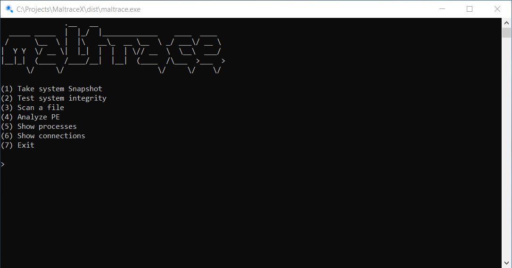

# MaltraceX
## Check your system integrity and scan for malicious files

<p align="center">

</p>

## Features 
- Take a snapshot of your system, either on Windows or Linux.
- Scan your system again and compare against your old snapshot and figure out which changes were made.
- Find out if new files were created in your chosen system path.
- Determine which processes are running and which were killed since last snapshot. 
- Virus Total integration - Choose whether to compare file hashes with VT database to get detection report from dozens of AVs.
- List specific folder files and easily choose which file to scan
- Windows Registry integration - Keep an eye on common registy keys used by different malwares and get notified about new keys.
- Analyze the PE struct of a file. Reports will be appended one after another with date so you can identifiy changes easily. 
- Show all running processes and their actual paths.
- List all connections and their corresponding PID.

<p align="center">

</p>

## Configure
- Change the scanning path in Conf/maltrace.conf to the path you would like to scan.
- Choose wheter you want to scan new hashes with Virus Total. If you do want, add your VT api key.
- Adjust the registry scan by adding or removing paths from Conf/registry.conf.
- Adjust logging path to your needs from Conf/paths.conf.


## Example log

```
----------------------------------------------------------------------------------
--------------------------------MaltraceX Log File---------------------------------
----------------------------------------------------------------------------------

Found new trace: /mnt/c/Windows/mal.exe was created on: Sat Sep 10 13:45:17 2022
File Hash: 0a73291ab5607aef7db23863cf8e72f55bcb3c273bb47f00edf011515aeb5894

---------------------------------------------------------------------------------------------------
----------------------------------------Virus Total report:----------------------------------------
---------------------------------------------------------------------------------------------------
Total Malicious: 43
Total Undetected: 16
File Reputation: -88
Suggested label: ransomware.wannacryptor/wanna
---------------------------------------------
Engines results:
---------------------------------------------
Bkav - undetected
Lionic - malicious
Elastic - malicious
Cynet - malicious
FireEye - malicious
CAT-QuickHeal - malicious
McAfee - malicious
Malwarebytes - undetected
VIPRE - malicious
Sangfor - malicious
K7AntiVirus - malicious
Alibaba - type-unsupported
K7GW - malicious
CrowdStrike - type-unsupported
Baidu - undetected
VirIT - undetected
Cyren - malicious
SymantecMobileInsight - type-unsupported
Symantec - malicious
tehtris - type-unsupported
ESET-NOD32 - malicious
APEX - type-unsupported
TrendMicro-HouseCall - malicious
Avast - malicious
ClamAV - malicious
Kaspersky - malicious
BitDefender - malicious
NANO-Antivirus - malicious
ViRobot - undetected
MicroWorld-eScan - malicious
Tencent - malicious
Ad-Aware - undetected
Trustlook - type-unsupported
Sophos - malicious
Comodo - malicious
F-Secure - undetected
DrWeb - malicious
Zillya - undetected
TrendMicro - malicious
McAfee-GW-Edition - malicious
SentinelOne - type-unsupported
Trapmine - type-unsupported
Emsisoft - malicious
Paloalto - type-unsupported
GData - malicious
Jiangmin - malicious
Webroot - type-unsupported
Avira - malicious
Kingsoft - undetected
Gridinsoft - malicious
Arcabit - malicious
SUPERAntiSpyware - undetected
ZoneAlarm - undetected
Avast-Mobile - type-unsupported
Microsoft - malicious
TACHYON - undetected
BitDefenderFalx - type-unsupported
AhnLab-V3 - malicious
Acronis - undetected
VBA32 - malicious
ALYac - undetected
MAX - malicious
Cylance - type-unsupported
Zoner - undetected
Rising - malicious
Yandex - undetected
Ikarus - malicious
MaxSecure - malicious
Fortinet - malicious
BitDefenderTheta - malicious
AVG - malicious
Cybereason - type-unsupported
Panda - malicious

----------------------------------------------------------------------------------

File - /mnt/c/Windows/system32/svchost.exe was changed on: Sat Sep 10 13:45:17 2022
Original hash : b51183de9bcc1294835d162e757053939ef666dcb8dc083d1326c3c33dd4edbc
New hash : 83596dc0a40eee825a51c6844c70a014b28776c1516d53114b71c0ea9c8fd506
Could not find file's hash in Virus Total database

-------------------------------------Windows Registry lookup:--------------------------------------

Found new registry key:
HKCU\Software\Microsoft\Windows\CurrentVersion\RunOnce
Key: C:\\Windows\System32\havoc.exe
----------------------------------------------------------------------------------
Found new value for: Common Startup
In: HKLM\Software\Microsoft\Windows\CurrentVersion\Explorer\Shell Folders
Old Value: C:\ProgramData\Microsoft\Windows\Start Menu\Programs\Startup
New Value: C:\ProgramData\046a106a85206eceb96acfc8086d25a0
----------------------------------------------------------------------------------
```
